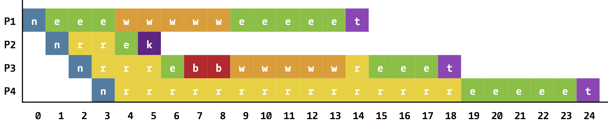

# TI 3 Übung 4
Tobias Lohse, Sven Klaus & Luisa Castano <br>
Tutor: Thomas Tegethoff, Do 8-10

## Aufgabe 1

###(a)
```c
#include <stdio.h>
int main(void)
{
	printf("main at: %p\n", main);
	while(1);
}
```
Die Ausgabe des obigen Programms ist immer `main at: 0x10f6d2f40`, auch wenn es mehrere male parallel gestartet wird.

Dies verwundert nicht, da in 64bit UNIX Systhemen für jeden Prozess die vollen 16TB virtueller Addressraum reserviert werden.\[1\] Daher können mehrere Prozesse dieselben virtuellen Adressen haben. Der Linker in ELF Sythemen wie UNIX erstellt ausführbare Dateien im ET_EXEC Format, bei dem die Addresse des Entry-Points (main funktion) immer dieselbe ist.\[2,3\]

Wenn ein Prozess einen lesezugriff auf eine Addresse macht, schaut die MMU im TLB nach, wo (HD, RAM, Caches) die Seite mit der Addresse für diesen Prozess liegt und erhält eine physikalische Addresse. Wenn nötig werden die Daten aus HD, RAM oder einem niedrigeren Cache in den obersten Cache geschrieben, aus dem die Daten dann an der Prozess weiter gegeben werden.

Quellen:<br>
\[1\]: [Princeton Solaris Troubleshoot VM](http://www.princeton.edu/~unix/Solaris/troubleshoot/vm.html) <br>
\[2\]: [Stackoverflow](http://stackoverflow.com/questions/3699845/how-is-it-that-main-function-is-always-loaded-at-the-same-address-whereas-variab) <br>
\[3\]: [RANDEXEC Docs](https://pax.grsecurity.net/docs/randexec.txt) <br>


###(b)

####(1)

n: new | e: running | r: ready | w: waiting | b: blocked | t: terminated | k: kill

####(2)
In Takt 7 und 8 befindet sich das System im Zustand "busy waiting", da P1 den Drucker benutzt und dadurch P3 blockiert ist, was die CPU blockt.

####(3)
UNIX Systheme besitzen einen Befehl `killall`, welcher es erlaubt einen beliebigen Prozess abzubrechen. Dies kann nützlich sein, wenn sich zum Beispiel ein Programm aufgehängt hat. Dasselbe kann in der Kommandozeile mit <kbd>ctrl</kbd>+<kbd>C</kbd>

## Aufgabe 2
```c
#include <stdio.h>
#include <stdlib.h>

{
	int pId;//ProzessID
	int aTime;//Ankunftszeit
	int sTime;//Ausfuehrungszeit
	struct pData *next;
	struct pData *prev;
};
typedef struct pData PROCESS;
typedef PROCESS *LINK;
int SIZE;

//Liest die Prozesse ein und erstellt die Liste
void readProcesses(LINK head)
{
	FILE *file = fopen("prcs.dat.txt", "r");
	if (file)
	{
		while( !feof(file) )
		{
			LINK newnode = malloc(sizeof(PROCESS));
			int id,at,st;
 			char c1,c2;
			fscanf(file, "%d %c %d %c %d", &id, &c1, &at, &c2, &st);
			newnode->pId = id;
			newnode->aTime = at;
			newnode->sTime = st;
			addProcess(head, newnode);
		}
		fclose(file);
	}
}

//Einen Prozess an das Ende der Liste (also vor head) einfuegen
void addProcess(LINK head,LINK newnode)
{
	newnode->next = head;
	newnode->prev = head->prev;
	head->prev->next = newnode;
	head->prev = newnode;
	SIZE++;
}

//Loeschen des angegebenen Knotens
void deleteProcess(LINK current)
{
	current->prev->next = current->next;
	current->next->prev = current->prev;
	SIZE--;
	free(current);
}

/*gibt den Prozess mit der kleinsten Id aus der Liste zurueck*/
LINK findNextProcess(LINK head)
{
	LINK curr = head->next;
	LINK min = curr;
	while ( curr != head )
	{
		if ( curr->pId < min->pId )
			min = curr;
		curr = curr->next;
	}
	return min;
}


/*Ausgabemethoden fuer die Prozesse und die gesamte Liste*/
void printPr(LINK current)
{
	printf("\n pId:%d arrival time:%d service time:%d\n ",
	       current->pId,current->aTime,current->sTime);
}
void printList(LINK head)
{
	printf("\n\n Current QUEUE of PROCESSES ------------------\n\n");
	LINK curr = head->next;
	while ( curr != head )
	{
		printPr(curr);
		curr = curr->next;
	}
}

int main(void)
{
	LINK head = malloc(sizeof(PROCESS));
	head->next = head;
	head->prev = head;
	readProcesses(head);
	while ( head->next != head )
	{
		printList(head);
		LINK next = findNextProcess(head);
		deleteProcess(next);
	}
	printList(head);

	return 0;
}
```
